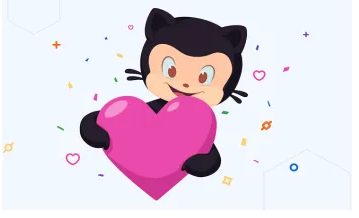

# Competitive Programming

## Description
In this repository i am going to add all my stuff which i had learned so far because i know i started and after how many stages i just
reached there and wanna keep moving like a rock but i want to open source all my content so that everyone can take full advantage of that
and make himself <Strong>competitive programmer</strong> and I'm herebly Welcoming all those who will contribute in that Now and in future.

